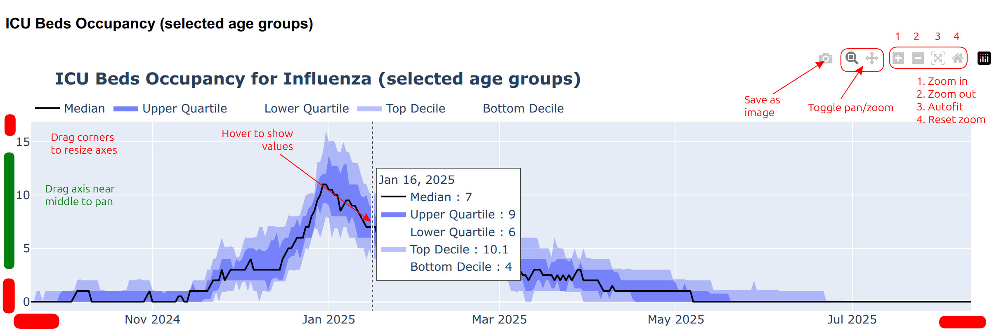

# Plotly graph controls

- Hover over a plot to expose its controls (top right corner).
- Drag the mouse along axes to zoom/pan a single axis.
- In zoom mode, click and drag within the plot area vertically/horizontally to zoom in along a single axis, or drag diagonally to zoom in on a rectangular area.
- In pan mode, click and drag within the plot area to pan the plot.
- Double-click within the plot area to reset the zoom level.

## Notes

- Clicking on a legend item will hide that item.  As Plotly is filling in the area between **pairs** of plot items (for some plots), **this may cause unintended behaviour**.
- Saving a plot as an image will use the current dashboard colour scheme (light/dark). Use the toggle in the dashboard header to change this setting.
