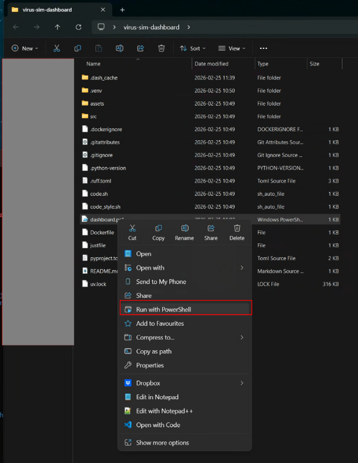
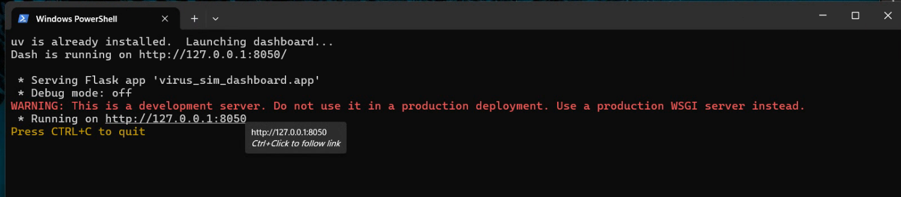
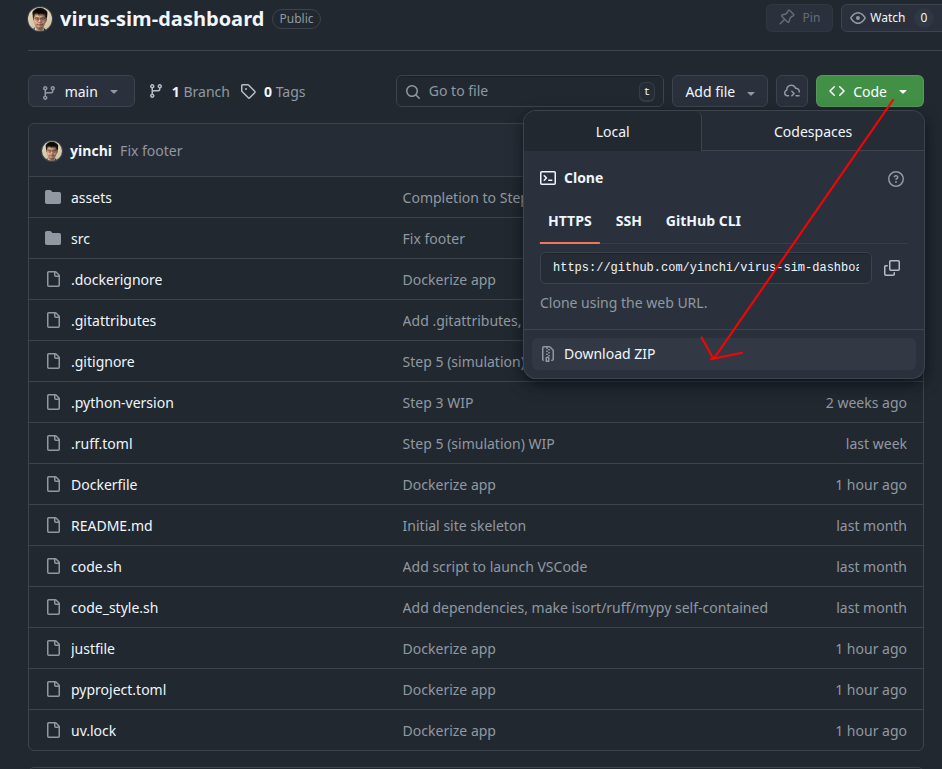

# Installing and running the dashboard

## 1. Automatic setup (Windows)

For Windows, the following instructions are the simplest way to launch the dashboard on your local machine.  However, the installation of `uv` (a required dependency) may be blocked by your organization's Windows policies. If so, or if running MacOS or Linux, try the manual installation options below.

1. Download and extract the project code.
2. Open the project directory, right-click on `dashboard.ps1`, and click "Run with PowerShell".
3. Open the link shown in the terminal output.





## 2. Manual setup

The recommended method to run the dashboard is via a local instance.  To install the dashboard on your local machine, follow the steps below:

### Step 1: install uv

`uv` is a package and project manager for Python, required to run the dashboard.  It ensures that all dependencies of the dashboard are installed, using a lockfile to ensure version compatibility between packages.

#### Windows

There are several options to install `uv` on Windows:

1. Download and execute the installation script: <https://astral.sh/uv/install.ps1>
2. Download the Windows binaries from <https://github.com/astral-sh/uv/releases> and add the directory containing your executable files to the PATH environment variable [following these instructions](https://www.wikihow.com/Change-the-PATH-Environment-Variable-on-Windows).
3. [Install WSL](https://learn.microsoft.com/en-us/windows/wsl/install), then open a new Ubuntu terminal and follow the instructions for Linux.

#### MacOS

On MacOS, it is highly recommended to install Homebrew.  Follow the instructions at <https://brew.sh/> to install it.  Then, execute:

```sh
brew install uv
```
You can read more about the `uv` Homebrew formula [here](https://formulae.brew.sh/formula/uv).

#### Linux (Debian/Ubuntu)

```sh
curl -LsSf https://astral.sh/uv/install.sh | sh
```
Follow the instructions in the terminal output to ensure `$HOME/.local/bin` is in your `$PATH` variable.

### Step 2: Obtain project files

If you have Git installed (see [installation instructions for Git](https://git-scm.com/install/)):

```sh
git clone https://github.com/yinchi/virus-sim-dashboard.git
```

Otherwise, download the ZIP file containing the project code and extract it:




### Step 3: launch the dashboard
Open the newly created project directory in a terminal and execute the following commands:

```sh
uv sync
uv run dashboard -H 0.0.0.0 --no-debug
```

The first command sets up and/or updates the Python virtual environment for the project, while the second launches the dashboard server locally at http://localhost:8050.

> [!NOTE]
> If port 8050 is already in use, add `-p <port>` to the `uv run` command above.