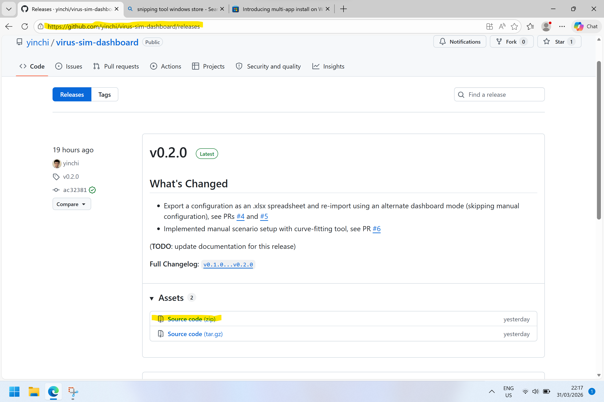
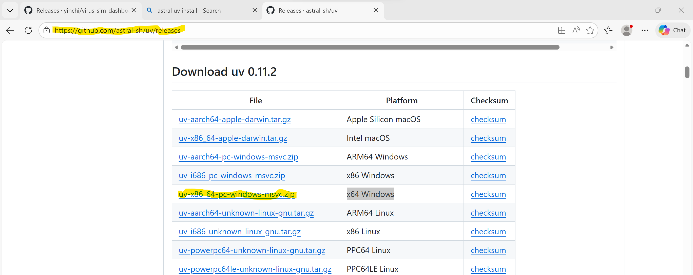
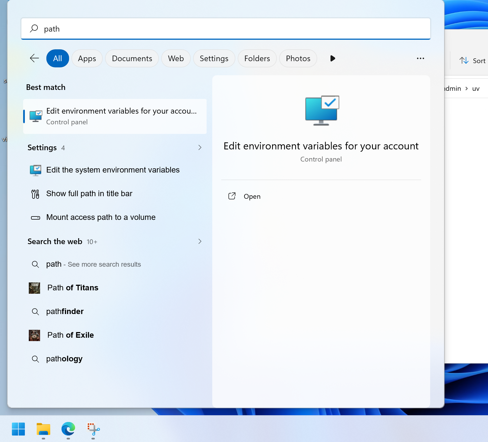
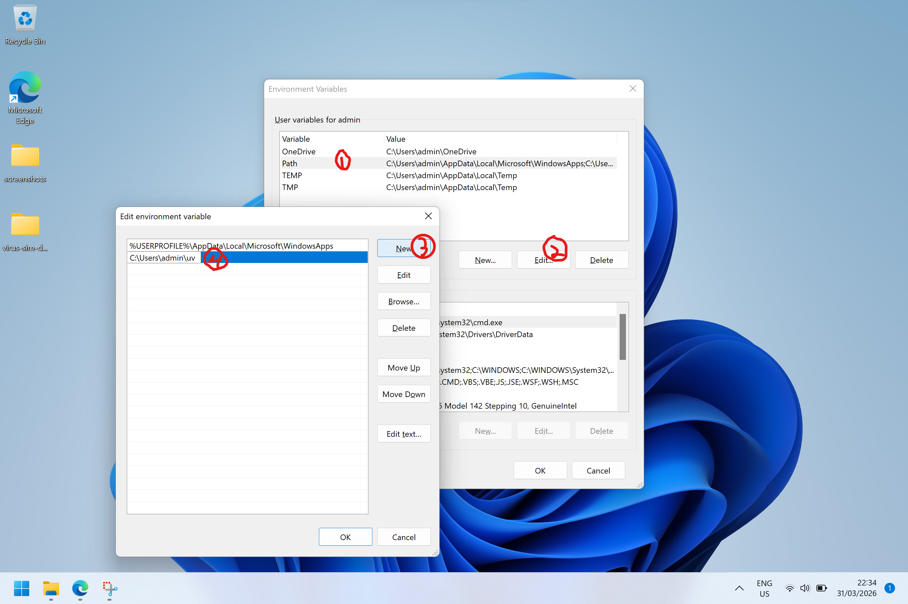
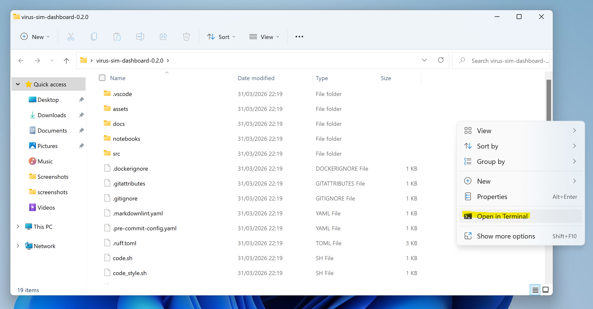
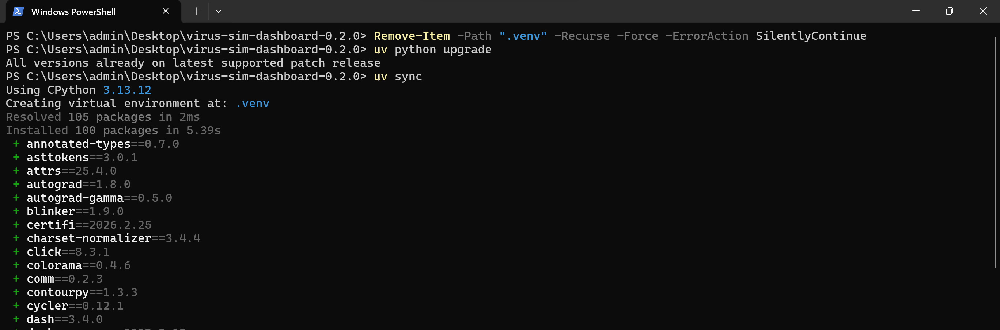
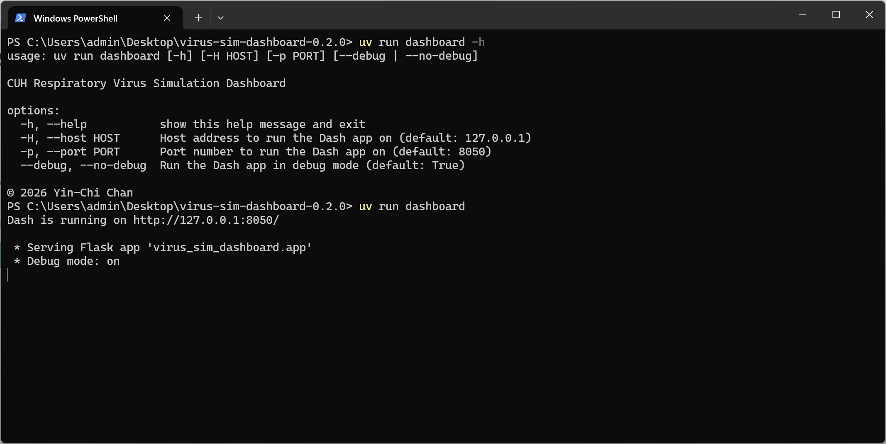

# Installing and running the dashboard

## 1. Downloading the latest release

Releases can be found at <https://github.com/yinchi/virus-sim-dashboard/releases>.  Download the latest release and unzip it to the desired directory location.



## 2. Download and install `uv`

[`uv` is a project and package manager](https://docs.astral.sh/uv/) for Python. Note you will only need to install `uv` once &mdash; even if you download a new release of the dashboard.

### Windows

If possible, execute the following Powershell script (⚠️ this may fail depending on your organization's Windows policies):

```ps
powershell -ExecutionPolicy ByPass -c "irm https://astral.sh/uv/install.ps1 | iex"
```

Alternatively, install `uv` manually:

1. Visit <https://github.com/astral-sh/uv/releases> and download the latest release for your platform (typically "x64 Windows").
   
2. Unzip the contents to a directory of choice. In this example, we use `C:\Users\admin\uv`.
3. Press the Windows/Start key on your keyboard, then type "path".  Click on the option "Edit environment variables for your account".
   
4. Add the path to the `uv` executable to the PATH environment variable.
   

### MacOS / Linux

Execute the following in a terminal:

```sh
curl -LsSf https://astral.sh/uv/install.sh | sh
```

For all platforms, you may need to start a new terminal session before using `uv`.

## 3. Setting up the Python virtual environment with `uv`

1. Open a terminal in the dashboard directory (or `cd` to the directory after opening the terminal).
   
2. Execute the following:
   

### Windows

```ps
Remove-Item -Path ".venv" -Recurse -Force -ErrorAction SilentlyContinue
uv python upgrade
uv sync
```

### Mac OS/Linux

```ps
rm -rf .venv/
uv python upgrade
uv sync
```

## 4. Running the dashboard

Type

```bash
uv run dashboard -h
```

for a list of command-line options.

Type

```bash
uv run dashboard
```

to launch the dashboard with default options.  Follow the link in the terminal output to view the dashboard.


