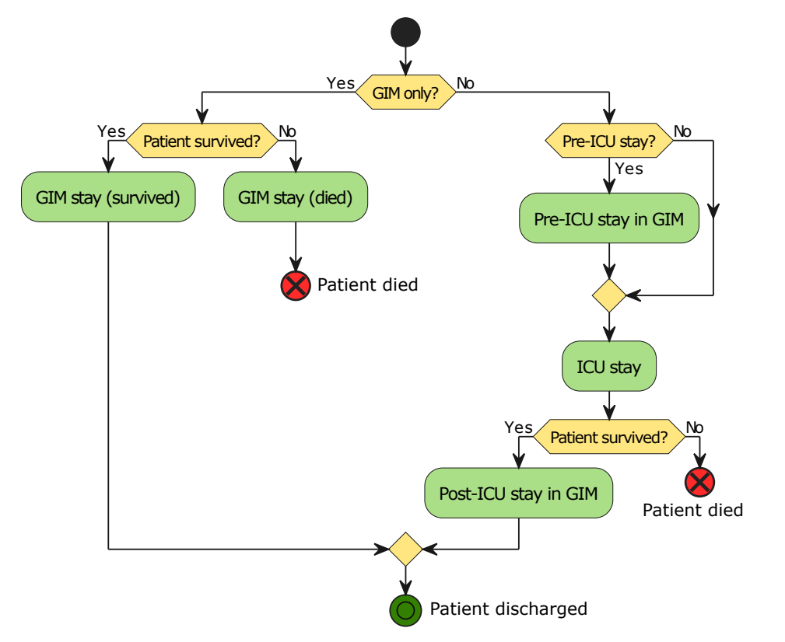
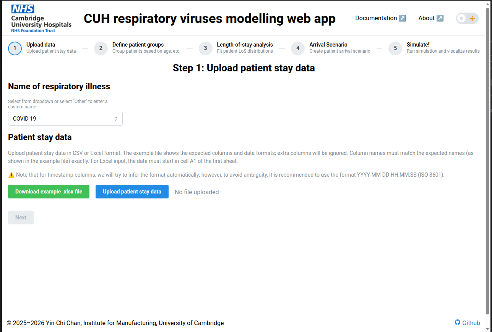
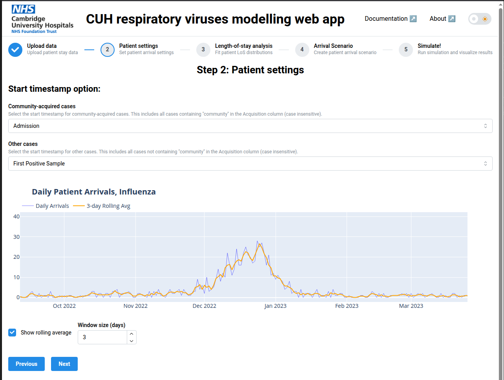
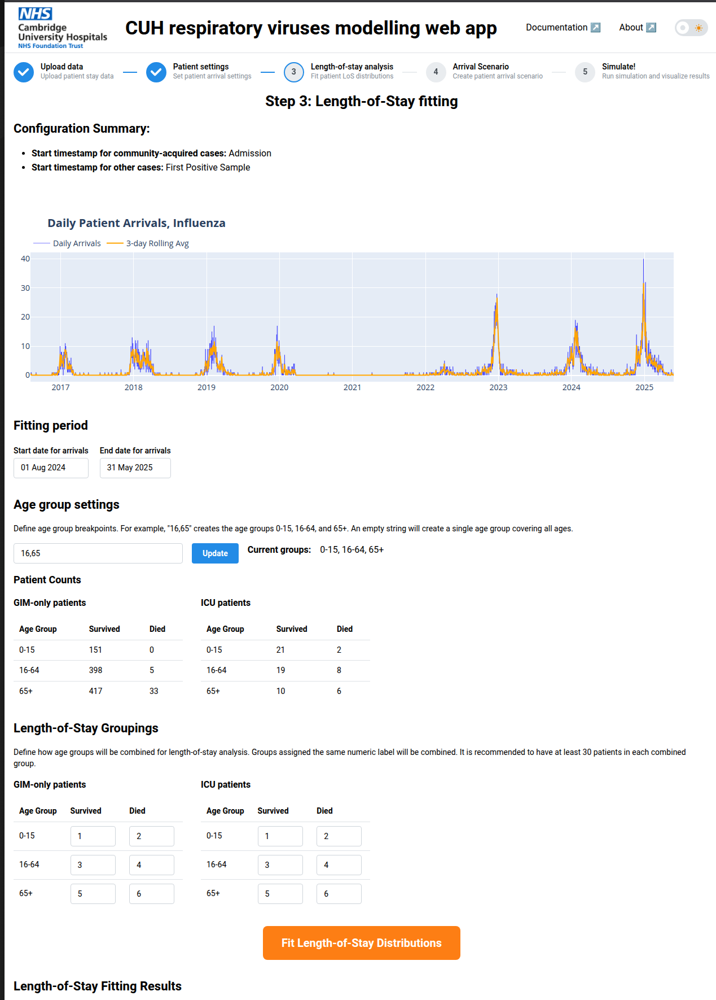
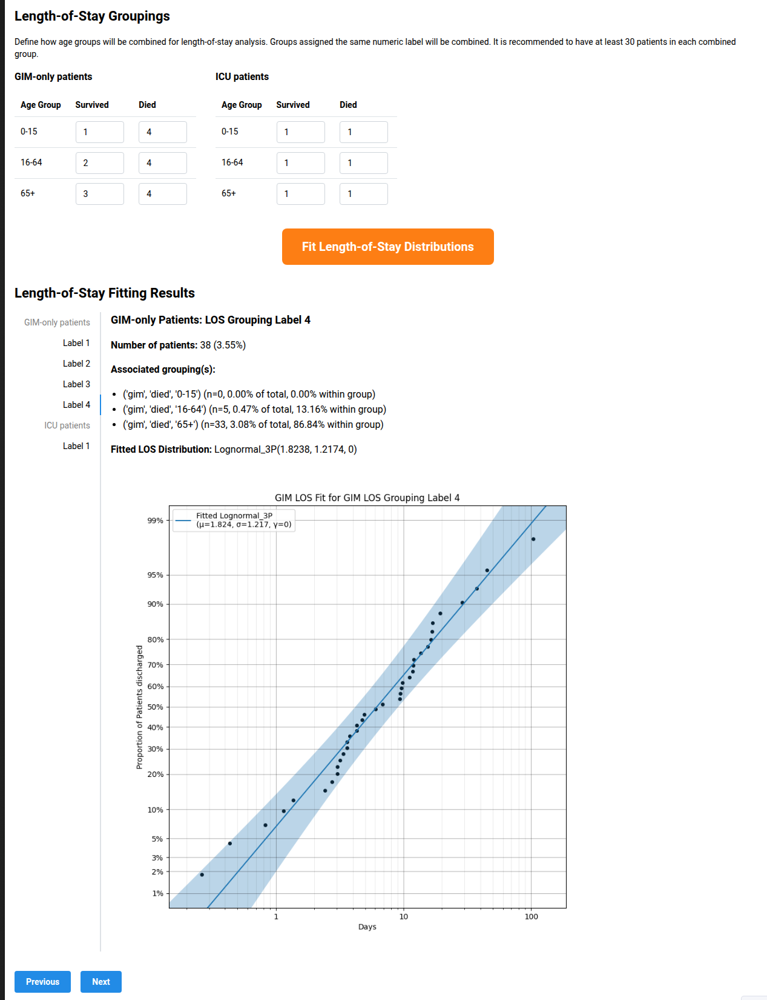
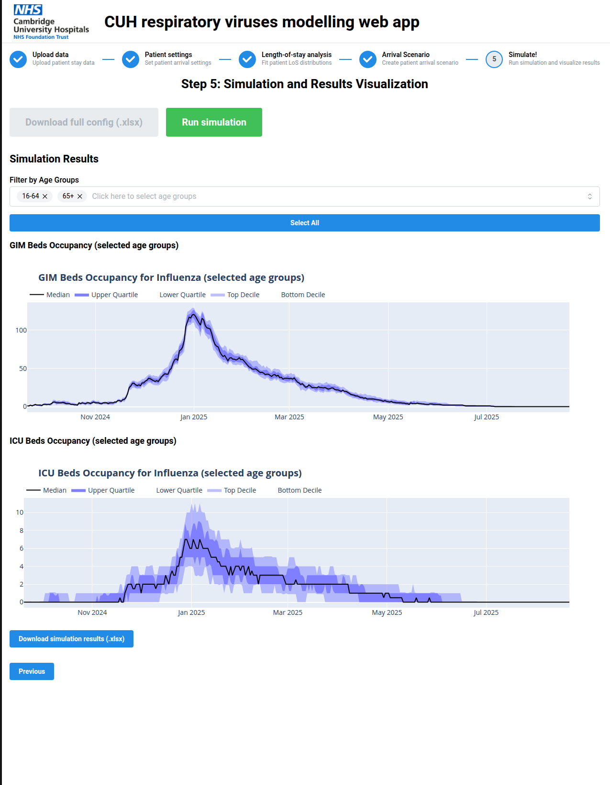

# Dashboard walkthrough

The dashboard uses simulation to estimate bed occupancy in a hospital caused by a given respiratory disease (e.g. COVID, influenza, or RSV).

Beds are divided into GIM (general internal medicine) beds and ICU beds.  Patients are classified as GIM-only patients and ICU patients.  ICU patients may optionally stay in the GIM ward before and after their ICU stay.

(flowchart from [Chan et al. 2023](https://yinchi.github.io/papers/ChanSimulation2023.pdf))

## Instructions

1. Open the dashboard in your browser.

## Step 1: Upload patient stay data

1. Select the disease name from the dropdown menu.  In this example, we shall use "Influenza".  You can also select "Other", in which case a text input field is provided.
2. Download the example Excel file (green button) containing patient stay data.  Optionally, inspect its contents.
3. Upload the file again (or provide your own file using the same data format) using the blue button.

>[!NOTE]
> The columns present in the example file are the minimum required by the dashboard, extra columns will be ignored.
>
> Cases are classified as community-acquired if the string "community" (case-insensitive) occurs **anywhere** in the Acquisition column for the corresponding spreadsheet row.  Patient are classified as deceased if the Summary column is "dead" or "deceased" (case-insensitive), or survived otherwise.

4. If the uploaded file is valid, the "Next" button should turn blue, click it to proceed to Step 2.

## Step 2: Patient settings

For both community-acquired and non-community-acquired cases (e.g. hospital-acquired and transfers), we can choose to start the occupancy period using the admission time, the collection time of the first positive sample, or whichever is earlier/later.  Adjust these settings using the two drop-down menus.

For convenience, a plot of daily patient arrivals is provided which will update based on the above settings.  See the [Plotly graph controls](./plotly.md) guide on how to pan/zoom plots or download a plot as an .png image.

Click "Next" to advance to Step 3.

>[!NOTE]
> You can also return to Step 1.  Information entered in each step is retained when navigating between steps unless modified, in which case information in subsequent steps is cleared.  For example, if the user completes Step 2, then returns to Step 1, the entered information in Step 2 is only cleared if the user modifies their Step 1 configuration and clicks "Next" to return to Step 2.

## Step 3: Length-of-stay fitting

1. Only patients will starting timestamps within the fitting period will be considered when fitting distributions to the length-of-stay data.  Adjust the fitting period using the two date pickers in the "Fitting period" section.
2. Choose the age groups to use for the simulation. For example, we can enter "16, 65" in the input field to split patients into the 0-15, 16-64, and 65+ age groups.
3. While we can divide patients by both age group and outcome (survived/died) for analysis, in practice some age/outcome groupings may have too few patients (or none at all) to fit a distribution to.  Use the numeric inputs in the "Length-of-Stay Groupings" section to combine age/outcome groupings; groupings with the same **label** are combined when fitting a length-of-stay distribution.  For the example patient stay data, the recommended group labellings are shown below.
4. Click the "Fit Length-of-Stay Distributions" button.

For each label, a summary is shown including a probability plot of the fitted distribution. In general, the closer the plotted points are to a straight line, the better the fit.  In the example above, the fitted distribution for GIM-only patients that die in hospital is a [lognormal distribution](https://en.wikipedia.org/wiki/Log-normal_distribution) with shift parameter $\gamma$, such that if $X$ is the length-of-stay, $\log(X-\gamma)$ has mean $\mu$ and standard deviation $\sigma$.

> [!NOTE]
> (**Not yet implemented**) The dashboard uses lognormal distributions for fitting. If the fit is poor, manual fitting may be required, in which case one should download the generated configuration (Excel) file in Step 5, edit the distribution information, and upload the edited Excel file to the alternate dashboard (**TODO**), which allows one to run a simulation on a completed configuration file rather than repeating Steps 1 to 4 of the full dashboard.
>
> See the documentation for the [reliability Python library](https://reliability.readthedocs.io/en/latest/Creating%20and%20plotting%20distributions.html) if using custom distributions.  We will provide full instructions once this feature is available.

5. Click "Next" to proceed to Step 4.

## Step 4: Arrival Scenario definition

Eventually, there will be two options, to upload an Excel file defining the scenario (two columns with dates and daily arrival numbers, respectively), or to generate a scenario from a set of parameters.  **Currently, only the first option is implemented.**

1. Click the green button to download the example scenario.
2. Upload the scenario Excel file using the "Upload config" button.  The scenario parameters will be shown on screen.
3. Optionally, adjust the jitter parameter to add randomness to the simulation.  If jitter is non-zero, then the number of arrivals for a given day can vary from the specified value by up to the specified jitter percentage.

# Step 5: Simulation

Click the green button to start the simulation.  After a few seconds, the simulation results should appear.

- You can select which age groups to include in the two plots (for GIM and ICU bed occupancy, respectively) using the multi-select menu (click on the Xs to remove an age group, or in the blank space to add a group).
- Hover over either plot to see details for a given date.

To download the simulation results in Excel form, click the corresponding blue button.  There are two sheets in the Excel workbook corresponding to GIM and ICU occupancy, respectively.  Each column represents a certain quantile in the simulation results, e.g. 0.5 represents the median and 0.9 the top decile (bed occupancy over 30 simulation runs).
