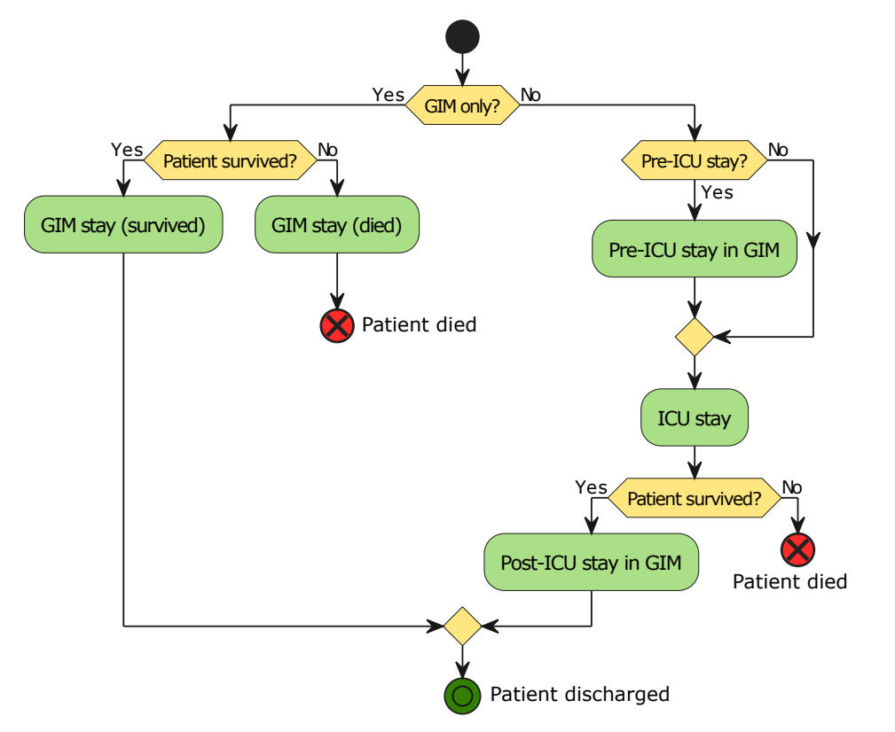
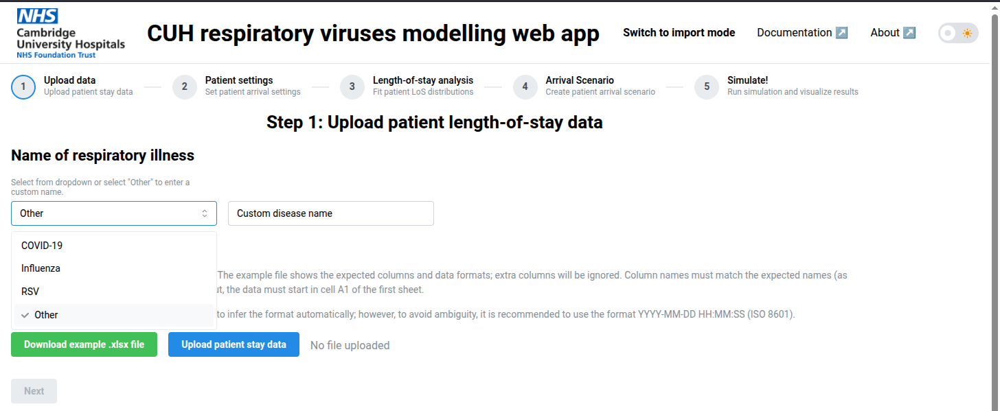
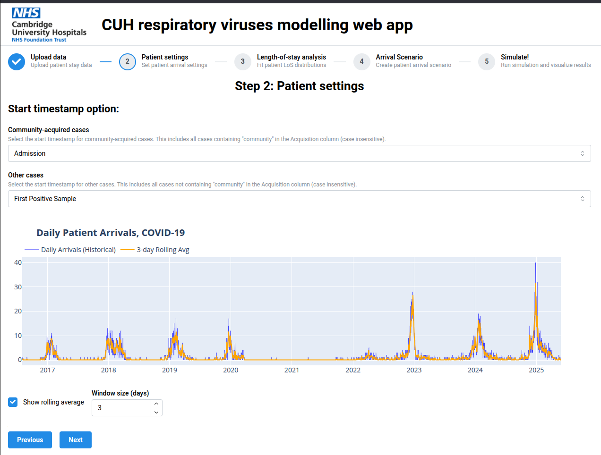
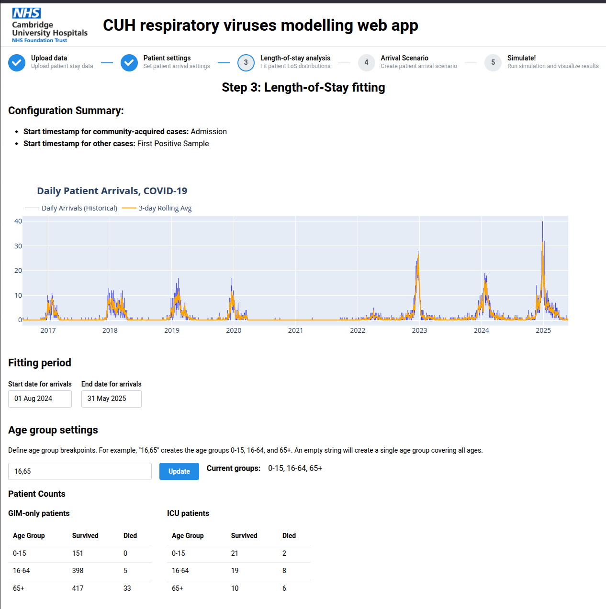
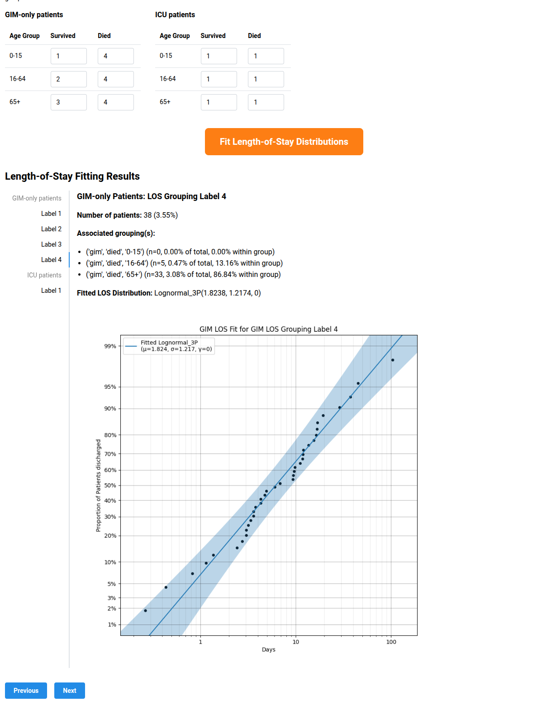
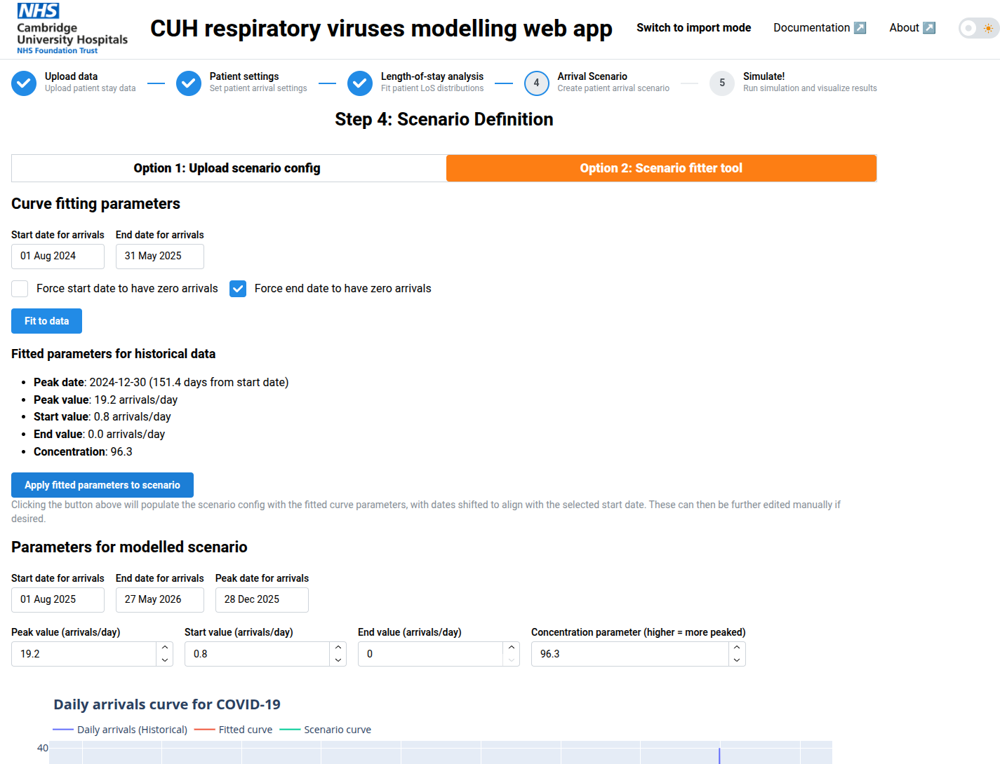
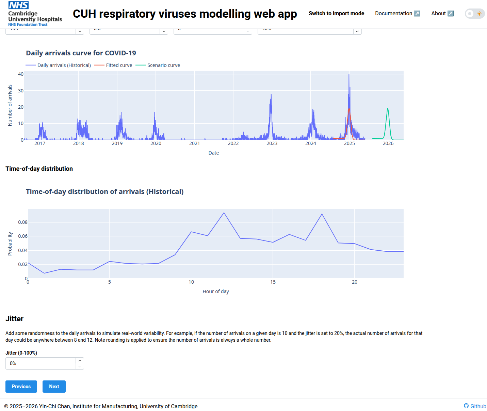
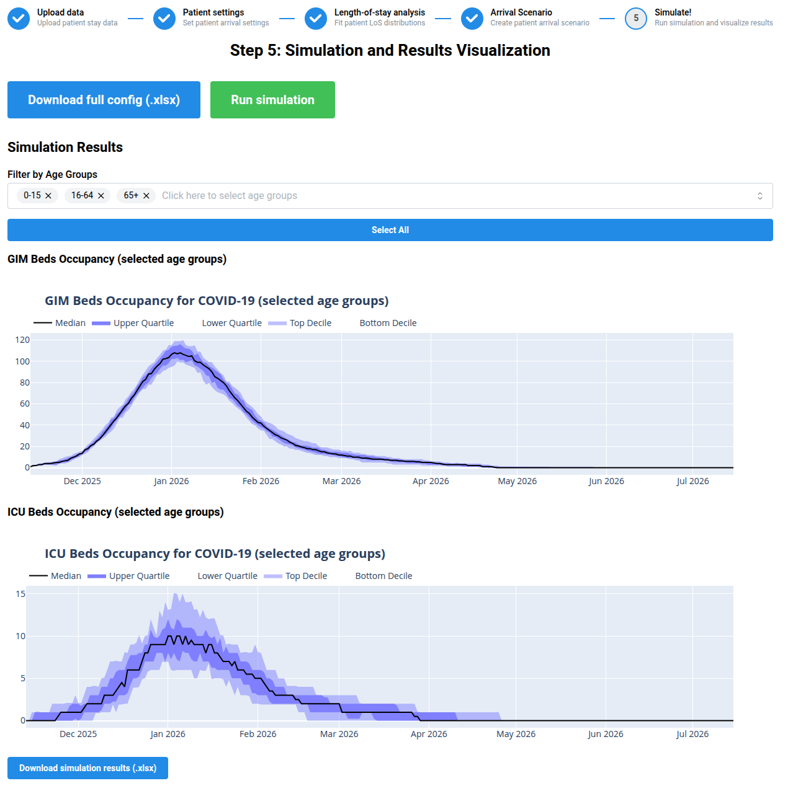

# Walkthrough

The dashboard uses simulation to estimate bed occupancy in a hospital caused by a given respiratory disease (e.g. COVID, influenza, or RSV).

Beds are divided into GIM (general internal medicine) beds and ICU beds.  Patients are classified as GIM-only patients and ICU patients.  ICU patients may optionally stay in the GIM ward before and after their ICU stay.

(flowchart from [Chan et al. 2023](https://yinchi.github.io/papers/ChanSimulation2023.pdf))

## Getting started

See the [Quickstart](quickstart.md) for instructions on downloading the project code and starting your own local instance of the dashboard web server.  The link to the dashboard will be displayed in your terminal:

## Step 1: Upload patient length-of-stay data

We use historical patient stay data to fit length-of-stay distributions to the various demographic groups and to bootstrap parameters for the scenario creation step (Step 4).  The data can be imported in either Excel (.xlsx) or CSV format.

First, select the disease which you want to model.  You can select a disease from the drop-down menu or enter a custom name.

Upload your patient data to the dashboard using the blue button.

> [!NOTE]
> The patient data file must contain the following columns (case sensitive, exact match only):
>
> - Age: Patient age in years (integer)
> - Admission: Patient admission timestamp
> - Discharge: Patient discharge (or death) timestamp
> - ICUAdmission: If present, the time when the patient is transferred to ICU.
> - ICUDischarge: If present, the time when the patient is discharged from ICU (or the time of death if the patient died in ICU).
> - Readmission: Time of readmission, if any.  If present, the readmission stay is included when computing the overall patient length-of-stay.  For a simple model without readmissions, both this and the next column can be left blank.
> - ReadmissionDischarge: If readmitted, the discharge timestamp for the additional stay.
> - FirstPosCollected: The collection timestamp of the first positive sample from the patient.
> - Acquisition: strings containing "community" (case-insensitive) are categorized as community-acquired cases, while all other string values correspond to non-community-acquired cases.
> - Summary: Patient outcome. We check whether the value contains the substring "dead" or "deceased" (case-insensitive), allowing us to derive different length-of-stay distributions for surviving and non-surviving patients.
>
> Any additional columns will be ignored.

Once the patient length-of-stay data has been uploaded, click "Next".

## Step 2: Patient settings

For both community-acquired and non-community-acquired cases (e.g. hospital-acquired and transfers), we can choose to start the occupancy period using the admission time, the collection time of the first positive sample, or whichever is earlier/later.  Adjust these settings using the two drop-down menus.

> [!NOTE]
> The default settings (Admission time for community-acquired cases, first positive sample time for other cases) are generally recommended.

For reference, a plot of daily admissions, using the chosen settings, is provided.  Use the numerical input field to change the rolling window size.

## Step 3: Length-of-Stay fitting

Use the datepickers to select the fitting period.  Then, define the age group breakpoints (e.g. "16,65" to create three age groups 0-15, 16-64, and 65+, or blank to use a single group for all ages).  The Patient Counts table will show the number of patients in each age group with arrivals within the selected dates, divided by outcome (survived or died).

As shown above, some groupings may contain very few or even no patients.  To address this, we assign **labels** to each group so that all groups with the same label are combined when computing length-of-stay distributions:

In the example above, the 38 patients who died after a GIM-only stay are all assigned **GIM label 4**, while any patient with an ICU stay are assigned **ICU label 1**.

For each label, the length-of-stay distribution is shown, along with a [Q-Q plot](https://en.wikipedia.org/wiki/Q%E2%80%93Q_plot) comparing the sampled and fitted distributions. In general, a good fit will show in the Q-Q plot as approaching a straight line.

> [!NOTE]
> The `reliability` Python package is used for length-of-stay distribution fitting. Specifically, the `Lognormal_3P` distribution was selected, which states that for a $Y\sim \text{Lognormal\_3P}(\mu,\sigma,\gamma)$ distribution, $\ln(Y-\gamma)$ is normally distributed with mean $\mu$ and standard deviation $\sigma$.
>
> We choose to provide a single distribution type to simplify the dashbaord interface, with numerical tests demonstrating a reasonably good fit for multiple diseases and demographic groupings.
>
> Note that you may see an error message if any label contains too few patients to perform a length-of-stay fit (e.g., if the selected fitting period/date range contains no data).  Furthermore, as only a fraction of ICU patients will stay in a GIM bed before/after their ICU stay (see the flowchart above), the distribution fitter may report an insufficient number of patient stays even when the **total** number of ICU patients is sufficient for fitting.
>
> The probability of a patient requiring an ICU stay, and the probability of an ICU patient staying in the GIM before/after their ICU stay (see the flowchart at the top of this page) is also obtained from the historical data at this step and used for the simulation model.

## Step 4, Option 1: Uploading a scenario configuration

The simulation scenario can be defined by uploading an Excel file with two sheets:

- "Daily Arrivals" should contain a "date" column and a "count" column showing the number of patient arrivals on each day.
- "Hourly Distribution" contains an "hour" column and a "probability" column showing the probability of a patient's arrival falling into each one-hour interval within a day.

Once uploaded, you can review the scenario using the plots shown.

Finally, the jitter input allows randomness to be inserted into the simulation scenario.  For example, if the number of arrivals on a given day is 10 and the jitter is set to 20%, the actual number of arrivals for that day could be anywhere between 8 and 12.

> [!NOTE]
> Rounding is applied to ensure the number of arrivals is always a whole number. The inputted arrival rate for a given day thus can be non-integer.

## Step 4, Option 2: Defining a simulation scenario manually using the fitter tool

The scenario fitter tool can create a simulation scenario from historical patient arrival data and contains several key sections:

- **Curve fitting parameters:** set the date range for the fitted scenario, and whether the scenario should have zero patient arrivals on its first and last days.
- **Parameters for modelled scenario:** controls for setting the simulation model parameters.  Clicking "Apply fitted parameters to scenario" from the "Curve fitting parameters" section will update the simulation parameters to created a time-shifted version of the fitted scenario.
- **Plot:** Visualization of the fitted and scenario daily arrival curves.
- **Jitter:** as in Option 1 ("Upload scenario config".)

The controls in the "Parameters for modelled scenario" section can be used to shift or reshape the fitted scenario.  For example, multiple scenarios which differ only in their peak value can be used to create a optimistic/base/pessimistic scenario comparison when predicting bed demand for a future disease outbreak.

> [!NOTE]
> The generated scenario is based on shifting and scaling a [beta probability distribution function](https://en.wikipedia.org/wiki/Beta_distribution#Mode_and_concentration), defined using mode and concentration parameters. The leading and trailing halves of the distribution can be scaled differently to allow for fixed starting and ending values (with a common peak).

## Step 5: Simulation and Results Visualization

Click "Run Simulation" to start the simulation.

Once the simulation is complete, plots of the simulated GIM and ICU bed occupancy over time will appear.  The central black line represents the median of the simulation runs, while the blue bands show the top/bottom deciles and quantiles.

The multiselect input can be used to select the age groups to include in the simulation results.  For example, if the age groups are 0-15, 16-64, and 65+, then the number of adult (16+) beds occupied can be shown by selecting the 16-64 and 65+ groups and deselecting the 0-15 group.

Results can be exported in Excel format using the provided button, but apply only to the currently selected set of age groups.  The column "t" shows dates, while the columns 0.1, 0.25, 0.5, 0.75, and 0.9 shows quantiles for the maximum bed occupancy on that date.  In particular, the 0.5 column gives the median bed occupancy across the simulation runs.

> [!NOTE]
> The number of simulation runs is set internally to 30.

### Scenario export

The simulation scenario can be exported as an Excel file.  This file can be used to re-run the scenario in the future, or modified to create a set of related scenarios for what-if analysis.

## Import mode

Import mode allows simulations to be run without manually setting up the scenario in Steps 1-4.  The interface of Import mode is similar to Step 5, but provides a button to upload the completed scenario configuration as an Excel file.  The file format should match that generated by the export tool in Step 5 of Manual mode.
